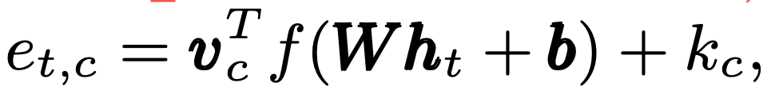

# attentive_pooling

## 2025-03-11

The vector is made after the BC-ResNet layers, and it's final layer is the GAP layer. Why not attentive_pooling?
Then the thing is, how can I get the attention score for the pooling?

